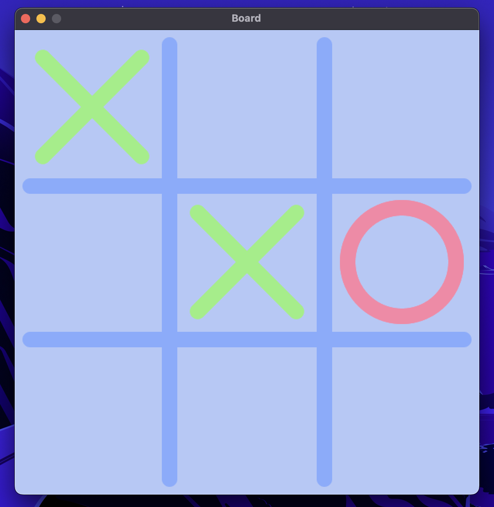

# Jeu de Morpion
> E3A | Programmation en language C



## Description

"Programmation en language C" class project. The goal is to create a Tic Tac Toe game in C language.

[The specifications provided for this project](https://github.com/matthieuEv/jeu-du-morpion/blob/main/support_projet_dirige_pplc.pdf)

## Installation

I listed the installation steps for Windows Linux and MacOS users.

### MacOS

1. Install the repository
```bash
git clone https://github.com/matthieuEv/jeu-du-morpion.git
```

2. Install the dependencies
```bash
# Install Homebrew
/bin/bash -c "$(curl -fsSL https://raw.githubusercontent.com/Homebrew/install/HEAD/install.sh)"

brew install cmake     # make
brew install gcc       # gcc
brew install glfw glew # Needed for the graphics in Etape 3
```

3. Run the project


### Ubuntu (not tested)

1. Install the repository
```bash
git clone https://github.com/matthieuEv/jeu-du-morpion.git
```

2. Install the dependencies
```bash
sudo apt install build-essential                              # install gcc and make
sudo apt-get install libglfw3-dev libglew-dev libgl1-mesa-dev # Needed for the graphics in Etape 3
```

3. Run the project


### Windows

1. Install the repository
```bash
git clone https://github.com/matthieuEv/jeu-du-morpion.git
```

2. Install the dependencies

First, you need to run `PowerShell` as an administrator.

2.1. Install Chocolatey

Run `Get-ExecutionPolicy`. If it returns `Restricted`, then run `Set-ExecutionPolicy AllSigned` or `Set-ExecutionPolicy Bypass -Scope Process`

```bash
Set-ExecutionPolicy Bypass -Scope Process -Force; [System.Net.ServicePointManager]::SecurityProtocol = [System.Net.ServicePointManager]::SecurityProtocol -bor 3072; iex ((New-Object System.Net.WebClient).DownloadString('https://community.chocolatey.org/install.ps1'))
```

Then, restart your computer.

2.2. Install the dependencies

- GLFW : Si vous avez chocolatey d'installé, il vous suffit d'exécuter `choco install glfw3`. Sinon, téléchargez depuis [glfw.org](https://www.glfw.org/download.html) et suivez les instructions d'installation.
- GLEW : Téléchargez depuis [glew.sourceforge.net](https://glew.sourceforge.net/) et suivez les instructions d'installation.
- OpenGL : Généralement, OpenGL est inclus avec les pilotes de votre carte graphique. Assurez-vous que vos pilotes sont à jour.

3. Run the project

## Run the project

You can test the different steps of the project by going to the different commits.

- Etape 1: `git checkout aa10b7c`
- Etape 2: `git checkout 2af172b`
- Etape 3: `git checkout .......`

Then, to run the project, go to the project folder where the file `Makefile` is and run the following command:

```bash
# For step 1, to test the different wins:
make test_draw
make test_circle
make test_cross

# For step 2
make etape2

# For step 3
make
```

## Contributors

I based the `Etape 3` on the work of [this repository](https://github.com/JulienGuitter/2D-OpenGL-Interface) by [Julien Guitter](https://github.com/JulienGuitter).